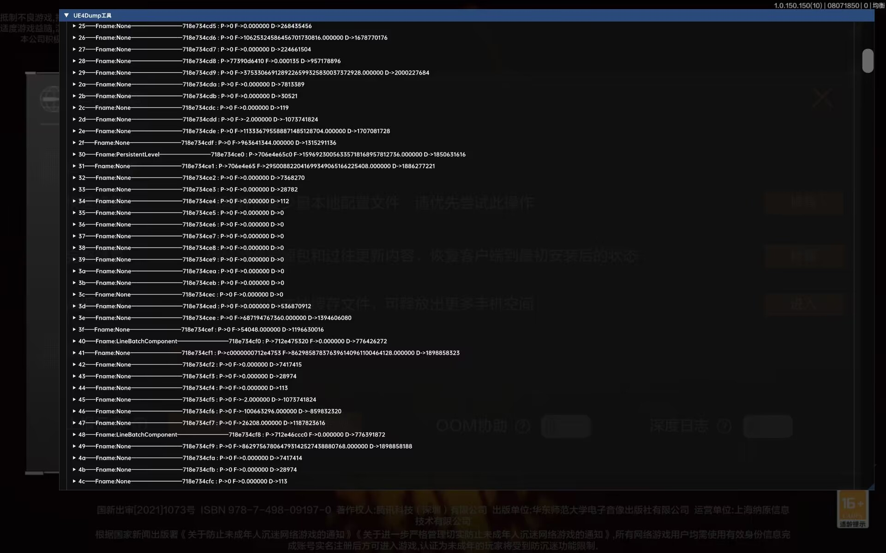

## AndroidImguiUE4dump

## 关于

[此项目基于 Android_Native_Surface](https://github.com/SsageParuders/Android_Native_Surface)
参考项目：
https://github.com/XiaoTouMingyo/UE4ForeachClass
https://github.com/kp7742/UE4Dumper

### 功能
- 项目支持到 Android 9 ~ 13
---
交流群：https://t.me/BigWhiteChat
### 效果图
  

### 下个版本
自动识别类型 自动找gname

### 此项目编译输出路径 outputs
# UE4ImguiDumper
